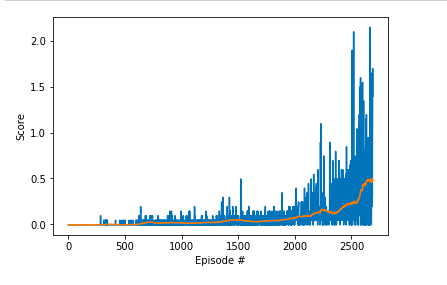

## Project's goal

In this environment, two agents control rackets to bounce a ball over a net. If an agent hits the ball over the net, it receives a reward of +0.1.  If an agent lets a ball hit the ground or hits the ball out of bounds, it receives a reward of -0.01.  **Thus, the goal of each agent is to keep the ball in play.**

The task is episodic, and in order to solve the environment, **the agents must get an average score of +0.5 (over 100 consecutive episodes, after taking the maximum over both agents)**. Specifically,

- After each episode, we add up the rewards that each agent received (without discounting), to get a score for each agent. This yields 2 (potentially different) scores. We then take the maximum of these 2 scores.
- This yields a single **score** for each episode.

The environment is considered solved, when the average (over 100 episodes) of those **scores is at least +0.5.**

## Environment details

The environment is based on [Unity ML-agents](https://github.com/Unity-Technologies/ml-agents). The project environment provided by Udacity is similar to the [Tennis](https://github.com/Unity-Technologies/ml-agents/blob/master/docs/Learning-Environment-Examples.md#tennis) environment on the Unity ML-Agents GitHub page.

> The Unity Machine Learning Agents Toolkit (ML-Agents) is an open-source Unity plugin that enables games and simulations to serve as environments for training intelligent agents. Agents can be trained using reinforcement learning, imitation learning, neuroevolution, or other machine learning methods through a simple-to-use Python API. 

The observation space consists of 8 variables corresponding to the position and velocity of the ball and racket. Each agent receives its own, local observation.  Two continuous actions are available, corresponding to movement toward (or away from) the net, and jumping. 

- Set-up: Two-player game where agents control rackets to bounce ball over a net.
- Goal: The agents must bounce ball between one another while not dropping or sending ball out of bounds.
- Agents: The environment contains two agent linked to a single Brain named TennisBrain. After training you can attach another Brain named MyBrain to one of the agent to play against your trained model.
- Agent Reward Function (independent):
  - +0.1 To agent when hitting ball over net.
  - -0.1 To agent who let ball hit their ground, or hit ball out of bounds.
- Brains: One Brain with the following observation/action space.
- Vector Observation space: 8 variables corresponding to position and velocity of ball and racket.
  - In the Udacity provided environment, 3 observations are stacked (8 *3 = 24 variables) 
- Vector Action space: (Continuous) Size of 2, corresponding to movement toward net or away from net, and jumping.
- Visual Observations: None.
- Reset Parameters: One, corresponding to size of ball.
- Benchmark Mean Reward: 2.5
- Optional Imitation Learning scene: TennisIL.

## Algorithm

    The algorithm used for the agent is DDPG.
    
    
    The Deep Deterministic policy gradient (DDPG) algorithm over Deep Q Network (DQN) is used for this project. This is because DDPG works on both continuous state and action space whereas DQN is meant to solve discrete action space problems as well.
    
The structure of the agent’s network is as follows.

Actor network:

Given the current state the actor is trained to output an approximation of the optimal policy action deterministically.

Critic network:

It computes the Q value for any given state or action by using actor’s best trusted action.
Four MLP layers are used for both actor and critic network.

Replay buffer:

Just like the DQN , this algorithm uses a reply buffer and sample from it randomly in order to break the correlation that exist because of the consecutive experiences .

Soft updates:
DDPG consists of 4 networks.
A regular (local) copy of actor network.
A target copy of the actor network.
A regular (local) copy of the critic network.
A target copy of the critic network.
The regular network is the updated network that is used for training as well as target which is used for prediction to stabilize the network.
    
    
    model.py file contains neural network definitions for actor and critic models
    
    multi_agent.py file implements Agent and ReplayBuffer classes
    
    checkpoint_actor.pth file contains model checkpoint for actor neural network
    
    checkpoint_critic.pth file contains model checkpoint for critic neural network
    
HYPERPARAMETERS:

    BUFFER_SIZE = int(1e5) (replay buffer size)
    BATCH_SIZE = 128 (minibatch size)
    GAMMA = 0.99 (discount factor)
    TAU = 1e-3 (for soft update of target parameters)
    LR_ACTOR = 1e-4 (learning rate of the actor)
    LR_CRITIC = 1e-4 (learning rate of the critic)
    WEIGHT_DECAY = 0 (L2 weight decay)
    UPDATE_EVERY = 1 (how many steps to take before updating target networks)
    
ACTOR NEURAL NETWORK:

    The Actor neural network consists of three fully connected (FC) layers.
    The input has 24 channels (each agent observes a state with length: 24)
    The output channels of the first FC layer is: 256
    The input and output channels of the second FC layer are: 256, 128
    The input channels of the third FC layer are: 128
    The output has 2 channels (actions: movement toward (or away from) the net, and jumping)

CRITIC NEURAL NETWORK:

    The Critic neural network consists of three fully connected (FC) layers.
    The input has 24 channels (each agent observes a state with length: 24)
    The output channels of the first FC layer is: 256
    The input channels of the second FC layer is: 256 + 2 (actions)
    The output channels of the second FC layer is: 128
    The output has 1 channel.
    

## Plot of rewards:

    The plot shows the reward received for each episode. In our case, environment was solved in 2689 episodes.
    

